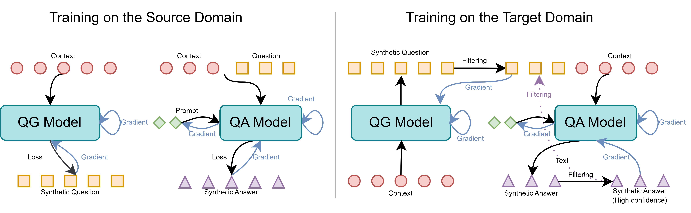

# MDAQA

Pytorch Implementation of the NAACL Paper: Source-Free Unsupervised Domain Adaptation for Question Answering via Prompt-Assisted Self-learning



This work addresses source-free domain adaptation (SFDA) for Question Answering (QA), wherein a model trained on a source domain is adapted to unlabeled target domains without additional source data. Existing SFDA methods only focus on the adaptation phase, overlooking the impact of source domain training on model generalizability. In this paper, we argue that source model training itself is also critical for improving the adaptation performance and stability. To this end, we investigate the role of prompt learning as an effective method to internalize domain-agnostic QA knowledge, which can be integrated into source training. After source training, an interactive self-learning strategy is proposed to further fine tune both model and prompt in the model adaptation phase. This leads to the Prompt-Assisted Self-Adaptive Learning (PASAL), an innovative SFDA approach for QA. Empirical evaluation on four benchmark datasets shows that PASAL surpasses existing methods in managing domain gaps and demonstrates greater stability across various target domains, validating the significance of source domain training for effective domain adaptation.

## Environment Setup

You need to clone our project

```
git clone git@github.com:maxwellyin/PASAL.git
```

Create the environment and download the packages

```
conda create -n PASAL python==3.9
conda activate PASAL
pip install -r requirements.txt
```

## Data Preparation

The datasets utilized for this study are sourced from the [MRQA Shared Task 2019](https://github.com/mrqa/MRQA-Shared-Task-2019), and have been further processed by Yue et al. These processed datasets are available for download [here](https://github.com/xiangyue9607/QVE?tab=readme-ov-file).

## Training and Evaluation

Train the base model:

```
cd v4
python prompt-tuning.py
```

Adapt to target domain:

```
python model-sf-after-p-sf.py
```

## Citing 

If you found this repository is helpful, please cite our paper:
```

```