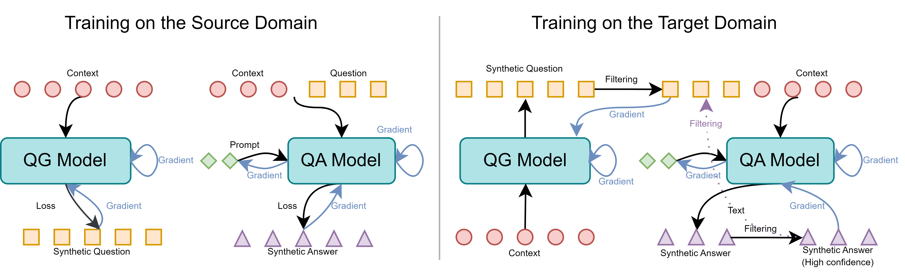

# PASAL

PyTorch implementation of the NAACL 2024 Findings paper
["Source-Free Unsupervised Domain Adaptation for Question Answering via Prompt-Assisted Self-learning"](https://aclanthology.org/2024.findings-naacl.44/).



## Overview

PASAL studies source-free unsupervised domain adaptation for extractive question answering. The setting assumes:

- a QA model trained on a labeled source domain,
- an unlabeled target domain,
- no access to source-domain training data during adaptation.

The repository explores two connected ideas:

1. prompt-assisted source training to improve transferability,
2. interactive self-learning on the target domain using pseudo question-answer pairs.

The codebase contains the implementation used for the paper as a research repository. It is now organized into a lightweight Python package plus script entry points, which makes the project easier to read and reuse.

## Highlights

- Prompt-augmented T5/Flan-T5 QA model with learnable encoder prompts
- Source-domain prompt tuning for stronger downstream adaptation
- Source-free target adaptation via pseudo-labeling
- Additional experimental variants, including domain-adversarial training

## Repository Layout

```text
PASAL/
├── readme.md               # Project overview and setup instructions
├── requirements.txt        # Python dependencies
├── environment.yml         # Conda environment definition
├── pyproject.toml          # Formatting and linting config
├── CITATION.cff            # Citation metadata for GitHub
├── model.png               # Figure from the paper
├── scripts/
│   ├── prompt_tuning.py        # Source-domain prompt tuning
│   ├── adapt_pasal.py          # Main PASAL adaptation pipeline
│   ├── eval.py                 # Evaluation entry point
│   ├── finetune_baseline.py    # Standard seq2seq baseline
│   └── ...
├── pasal/
│   ├── model.py                # Customized T5 implementation with prompt embeddings
│   ├── experiments.py          # Shared training/self-training helpers
│   ├── pseudo_labeling.py      # Pseudo-label generation strategies
│   ├── runtime.py              # Shared runtime/path helpers
│   ├── util.py                 # Preprocessing, metrics, constants
│   ├── qg.py                   # Question generation utilities
│   └── ae.py                   # Answer extraction utilities
└── legacy/
    └── README.md               # Notes on the archived historical layout
```

## Environment Setup

The original experiments were developed with Python 3.9.

```bash
git clone git@github.com:maxwellyin/PASAL.git
cd PASAL

conda create -n pasal python=3.9
conda activate pasal
pip install -r requirements.txt
```

Or create the environment directly:

```bash
conda env create -f environment.yml
conda activate pasal
```

## Data Preparation

The experiments use MRQA-style QA datasets. The processed datasets referenced by this repository come from the preprocessing pipeline released in the QVE project:

- MRQA Shared Task 2019: [github.com/mrqa/MRQA-Shared-Task-2019](https://github.com/mrqa/MRQA-Shared-Task-2019)
- Processed datasets: [github.com/xiangyue9607/QVE](https://github.com/xiangyue9607/QVE)

By default, the scripts expect datasets to exist under:

```text
../../largeQA/data/
```

with names such as:

- `SQuAD_train`
- `SQuAD_test`
- `NaturalQuestionsShort_train`
- `NaturalQuestionsShort_test`

The default source and target domains are defined in [`pasal/util.py`](pasal/util.py).

## Quick Start

### 1. Train the source-domain prompt model

```bash
python scripts/prompt_tuning.py
```

For example, to override the source domain or data path:

```bash
python scripts/prompt_tuning.py \
  --source-domain SQuAD \
  --data-root /path/to/largeQA/data \
  --cuda-visible-devices 0
```

This script:

- loads the source-domain dataset,
- prepends a learned soft prompt to the encoder input,
- freezes the backbone,
- optimizes only the prompt embedding.

### 2. Adapt to the target domain

```bash
python scripts/adapt_pasal.py
```

For example:

```bash
python scripts/adapt_pasal.py \
  --target-domain NaturalQuestionsShort \
  --train-subset 10000 \
  --cuda-visible-devices 0
```

This script:

- generates pseudo questions from target-domain contexts,
- answers them with the current QA model,
- filters pseudo-labeled examples,
- performs target-domain self-training.

### 3. Evaluate on a target domain

```bash
python scripts/eval.py
```

Or evaluate an explicit checkpoint:

```bash
python scripts/eval.py \
  --target-domain NewsQA \
  --checkpoint-path ./checkpoints/prompt-flan-t5-base-SQuAD/base/final
```

For a more detailed script guide, see [`scripts/README.md`](scripts/README.md).

## Reproducibility Notes

- Many experiment settings are configured as constants inside the scripts rather than CLI arguments.
- The main scripts now expose CLI flags for dataset roots, domains, checkpoints, and optional `CUDA_VISIBLE_DEVICES`.
- Shared training and pseudo-labeling logic now lives in reusable helper modules under [`pasal/`](pasal/).
- The original historical `v4/` layout has been de-emphasized for presentation purposes and treated as legacy.
- The repository preserves the original experimental layout from the paper rather than a fully refactored training package.

In other words, this repo is intended to document and expose the research implementation faithfully, while remaining practical to inspect and rerun.

## Citation

If this repository is useful in your research, please cite:

```bibtex
@inproceedings{yin-etal-2024-source,
  title = "Source-Free Unsupervised Domain Adaptation for Question Answering via Prompt-Assisted Self-learning",
  author = "Yin, Maxwell and Wang, Boyu and Ling, Charles",
  booktitle = "Findings of the Association for Computational Linguistics: NAACL 2024",
  year = "2024",
  month = jun,
  pages = "700--713",
  address = "Mexico City, Mexico",
  publisher = "Association for Computational Linguistics",
  url = "https://aclanthology.org/2024.findings-naacl.44"
}
```
